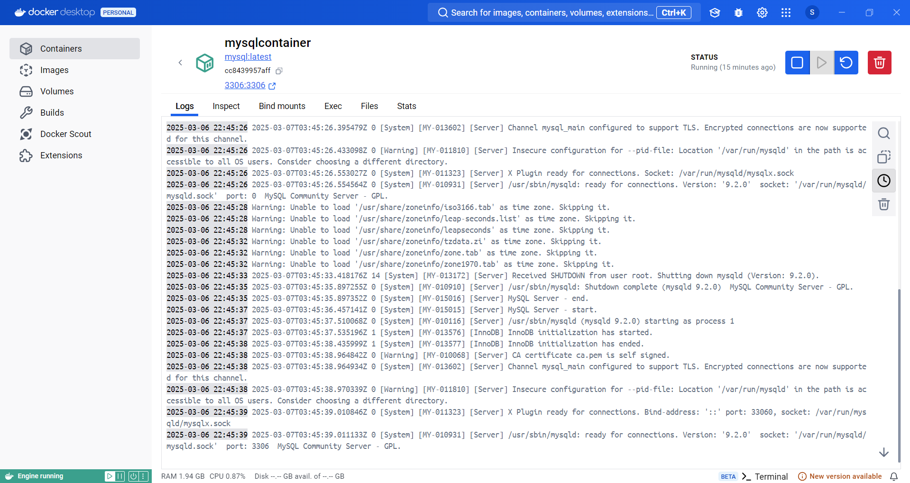
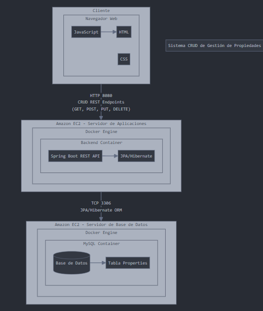
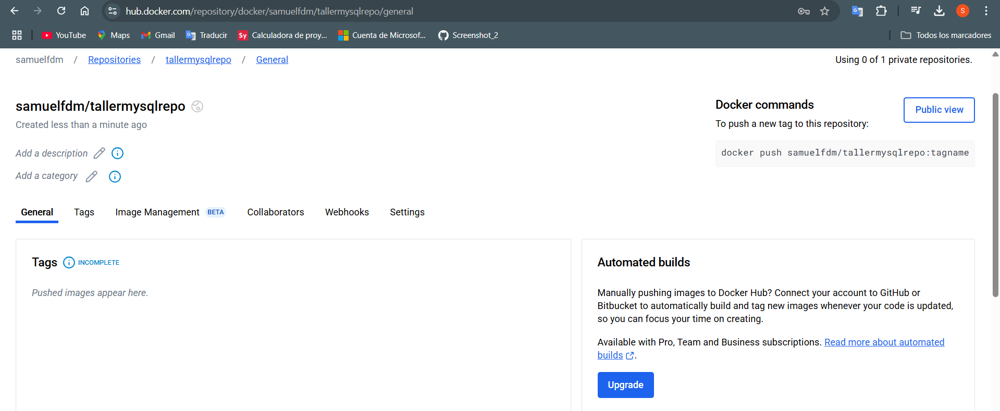
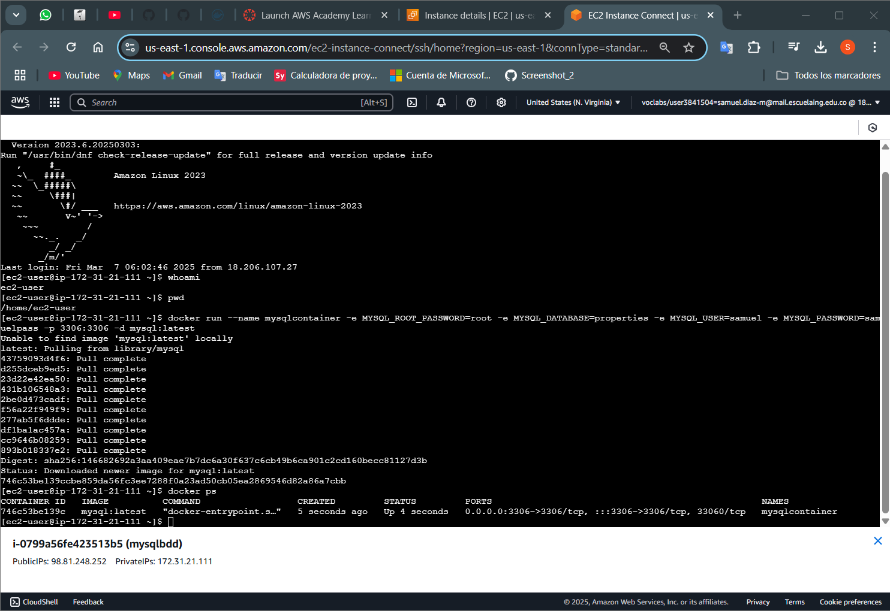
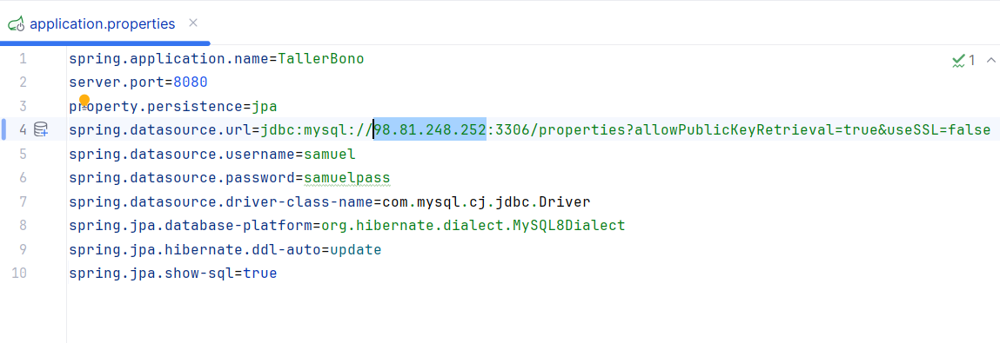
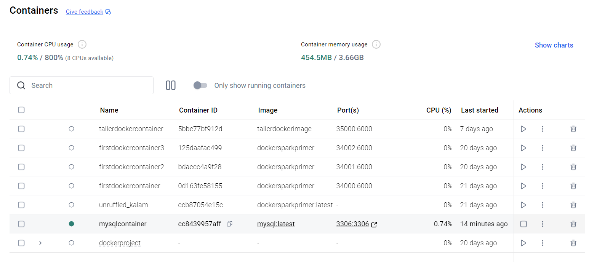

# Property Management CRUD System

## Project Summary

This project is a comprehensive CRUD (Create, Read, Update, Delete) system designed for managing real estate properties. The application allows users to:

- Create new property listings with details such as address, price, size, and description
- View a paginated list of properties with 3 properties per page
- View detailed information for each property listing
- Update existing property information through an interactive form
- Delete property listings that are no longer needed
- Search properties by address or description

The system is built using a modern three-tier architecture with a responsive web frontend, a Spring Boot REST API backend, and a MySQL database for persistent storage. All components are containerized using Docker and deployed on separate Amazon EC2 instances, ensuring scalability and separation of concerns.

## System Architecture

The application follows a standard three-tier architecture:

### Frontend
- **Technologies**: HTML, CSS, JavaScript
- **Features**:
   - Responsive user interface with forms for property information entry
   - Client-side validation for data integrity
   - Fetch API for asynchronous communication with the backend
   - Interactive property listings with options to view, update, and delete entries
   - Pagination with configurable page size
   - Search functionality for filtering properties

### Backend
- **Technologies**: Spring Boot, JPA/Hibernate
- **Features**:
   - RESTful API endpoints for all CRUD operations
   - Data validation and error handling
   - ORM mapping between Java objects and database entities
   - Pagination support through Spring Data
   - Search functionality through custom repository methods
   - Containerized deployment using Docker

### Database
- **Technologies**: MySQL
- **Features**:
   - Relational database with a properties table
   - Persistent storage for all property data
   - Containerized deployment using Docker

### Interaction Flow


1. **Client-Server Communication**: The frontend communicates with the backend through HTTP requests (GET, POST, PUT, DELETE) over port 8080.
2. **Data Persistence**: The backend communicates with the MySQL database using JPA/Hibernate over TCP port 3306.
3. **Service Isolation**: Each tier runs in its own Docker container on separate EC2 instances for improved security and scalability.

## Class Design

The backend application follows a layered architecture with clear separation of concerns:

### Class Diagram (Detailed)

```
+------------------------+       +------------------------+       +------------------------+
|   PropertyController   |       |    PropertyService     |       |  PropertyPersistence   |
+------------------------+       +------------------------+       +------------------------+
| - propertyService      |------>| - propertyPersistence  |------>| + findAll()            |
+------------------------+       +------------------------+       | + findById()           |
| + createProperty()     |       | + create()             |       | + save()               |
| + getProperties()      |       | + getProperties()      |       | + deleteById()         |
| + getProperty()        |       | + getProperty()        |       | + findByAddress...     |
| + deleteProperty()     |       | + deleteProperty()     |       +------------------------+
| + updateProperty()     |       | + updateProperty()     |              ^        ^
| + searchProperties()   |       | + searchProperties()   |              |        |
+------------------------+       +------------------------+              |        |
                                                                         |        |
                                                                         |        |
+-------------------------------------------+      +-------------------------------------------+
|       JpaPropertyRepository               |      |     InMemoryPropertyRepository           |
+-------------------------------------------+      +-------------------------------------------+
| + findAll()                               |      | - properties: List<Property>             |
| + findByAddressContainingOrDescription... |      | - currentId: Long                        |
+-------------------------------------------+      | + findAll()                              |
                                                   | + findById()                             |
                                                   | + save()                                 |
                                                   | + deleteById()                           |
                                                   | + findByAddressContainingOrDescription...|
                                                   +-------------------------------------------+
                                
                                        |
                                        |
                                        v
                      +------------------------------------+
                      |              Property              |
                      +------------------------------------+
                      | - id: Long                         |
                      | - address: String                  |
                      | - price: long                      |
                      | - size: int                        |
                      | - description: String              |
                      +------------------------------------+
                      | + getters/setters                  |
                      | + toString()                       |
                      +------------------------------------+
```

#### Modelo de dominio

## Property (Entidad): Clase principal que representa una propiedad inmobiliaria.

Atributos: id, address, price, size, description
Anotada con @Entity y @Id, @GeneratedValue para el identificador

### Capa de persistencia

## PropertyPersistence (Interfaz): Define las operaciones de acceso a datos.

Métodos: findAll, findById, save, deleteById, findByAddressContainingOrDescriptionContaining
Soporta paginación a través de parámetros Pageable

## JpaPropertyRepository: Implementación JPA de la interfaz PropertyPersistence.

Extiende JpaRepository de Spring Data
Usa consultas personalizadas con anotaciones @Query
Anotada con @Repository("jpa")

## InMemoryPropertyRepository: Implementación alternativa en memoria para pruebas.

Mantiene una lista de propiedades y un contador de ID
Anotada con @Repository("memory")

### Capa de servicio

## PropertyService: Contiene la lógica de negocio.

Depende de PropertyPersistence (inyección de dependencias)
Proporciona métodos para todas las operaciones CRUD
Anotada con @Service

### Capa de controlador

## PropertyController: Maneja las peticiones HTTP REST.

Depende de PropertyService (inyección de dependencias)
Expone endpoints para todas las operaciones CRUD
Incluye funcionalidad de búsqueda y paginación
Anotada con @RestController

## Deployment Instructions

### Prerequisites
- AWS Account with EC2 access
- Docker installed on local machine and EC2 instances
- Git installed on local machine

### Local Setup and Testing

1. **Clone the repository**
   ```bash
   git clone https://github.com/Samuelfdm/AREP_TALLER05_BONO.git
   cd TallerBono
   ```

2. **Set up the database locally**
   ```bash
   docker run --name mysqlcontainer -e MYSQL_ROOT_PASSWORD=root -e MYSQL_DATABASE=properties -e MYSQL_USER=samuel -e MYSQL_PASSWORD=samuelpass -p 3306:3306 -d mysql:latest
   ```

3. **Build and run the backend**
   ```bash
   mvn spring-boot:run
   ```

4. **Access the application**
   - http://localhost:8080/

### AWS Deployment

1. **Create EC2 Instances**
   - Create two EC2 instances using Amazon Linux 2 AMI:
      - property-backend-server (t2.micro)
      - property-db-server (t2.micro)
   - Configure security groups:
      - Backend: Allow inbound traffic on ports 22 (SSH), 8080 (HTTP), and 80 (HTTP)
      - Database: Allow inbound traffic on ports 22 (SSH) and 3306 (MySQL) from the backend server IP only

2. **Install Docker on both EC2 instances**
   ```bash
   ssh -i "your-key.pem" ec2-user@your-instance-public-ip
   sudo yum update -y
   sudo amazon-linux-extras install docker -y
   sudo service docker start
   sudo usermod -a -G docker ec2-user
   sudo systemctl enable docker
   ```
   Log out and log back in to apply the group changes.

3. **Deploy the database container on the database EC2 instance**
   ```bash
   # On the database EC2 instance
   docker run --name mysqlcontainer -e MYSQL_ROOT_PASSWORD=root -e MYSQL_DATABASE=properties -e MYSQL_USER=samuel -e MYSQL_PASSWORD=samuelpass -p 3306:3306 -d mysql:latest
   ```

4. **Deploy the backend on the application EC2 instance**
   ```bash
   # On the application EC2 instance
   # Clone your repository
   git clone https://github.com/your-username/property-management.git
   cd property-management
   
   # Update the application.properties file with the correct database IP
   sed -i 's/localhost/your-db-instance-private-ip/g' src/main/resources/application.properties
   
   # Build the application
   ./mvnw clean package
   
   # Build and run the Docker container
   docker build -t property-backend .
   docker run -d -p 8080:8080 --name property-backend property-backend
   ```

5. **Deploy the frontend**
   - Option 1: Use the backend EC2 instance to serve static files
     ```bash
     # On the backend EC2 instance
     sudo amazon-linux-extras install nginx1 -y
     sudo systemctl start nginx
     sudo systemctl enable nginx
     
     # Copy frontend files to nginx
     sudo mkdir -p /usr/share/nginx/html/property-management
     sudo cp -r frontend/* /usr/share/nginx/html/property-management/
     
     # Update the API_URL in app.js to point to the backend
     sudo sed -i 's|http://localhost:8080/properties|http://your-backend-instance-public-ip:8080/properties|g' /usr/share/nginx/html/property-management/scripts/app.js
     ```

   - Option 2: Use Amazon S3 for hosting
     ```bash
     # Configure S3 bucket for static website hosting
     aws s3 mb s3://property-management-frontend
     aws s3 website s3://property-management-frontend --index-document index.html
     
     # Update API_URL in app.js
     sed -i 's|http://localhost:8080/properties|http://your-backend-instance-public-ip:8080/properties|g' frontend/scripts/app.js
     
     # Upload files to S3
     aws s3 sync frontend/ s3://property-management-frontend --acl public-read
     ```

6. **Configure CORS (if needed)**
   Add the following to your Spring Boot application:
   ```java
   @Configuration
   public class WebConfig implements WebMvcConfigurer {
       @Override
       public void addCorsMappings(CorsRegistry registry) {
           registry.addMapping("/**")
               .allowedOrigins("*") // In production, restrict this to your frontend domain
               .allowedMethods("GET", "POST", "PUT", "DELETE", "OPTIONS")
               .allowedHeaders("*");
       }
   }
   ```

7. **Access the deployed application**
   - Frontend: http://your-backend-instance-public-ip (if using Nginx)
   - Backend API: http://your-backend-instance-public-ip:8080/properties

### Docker Commands Reference

#### MySQL Container
```bash
docker run --name mysqlcontainer -e MYSQL_ROOT_PASSWORD=root -e MYSQL_DATABASE=properties -e MYSQL_USER=samuel -e MYSQL_PASSWORD=samuelpass -p 3306:3306 -d mysql:latest
```

#### Backend Container
```bash
docker build -t property-backend .
docker run -d -p 8080:8080 --name property-backend property-backend
```

### Monitoring and Maintenance

1. **View container logs**
   ```bash
   docker logs property-backend
   docker logs mysqlcontainer
   ```

2. **Restart containers**
   ```bash
   docker restart property-backend
   docker restart mysqlcontainer
   ```

3. **Stop and remove containers**
   ```bash
   docker stop property-backend && docker rm property-backend
   docker stop mysqlcontainer && docker rm mysqlcontainer
   ```

****VIDEO - PRUEBAS DE FUNCIONAMIENTO DEL DESPLIEGE****


**Para probar el servicio puedes usar las siguientes rutas de prueba**

Pruebas
-------

Se han realizado pruebas unitarias para asegurar el correcto funcionamiento de cada componente. Las pruebas incluyen:

*   **Pruebas de MicroServer**: Verifican que se cargen los componentes correctamente.



*   **Pruebas de HttpServer**: Verifican que el servidor pueda iniciar y aceptar conexiones.



*   **Pruebas de RequestHandler**: Aseguran que las solicitudes HTTP sean procesadas correctamente.



*   **Pruebas de StaticFileHandler**: Comprueban que los archivos estáticos sean servidos adecuadamente.



*   **Pruebas de ResponseHelper**: Validan que las respuestas HTTP sean construidas correctamente.



Para ejecutar las pruebas, utiliza el siguiente comando:

    mvn test



Contribuciones
--------------

Si deseas contribuir a este proyecto, por favor sigue los siguientes pasos:

1.  Haz un fork del repositorio.

2.  Crea una nueva rama (git checkout -b feature/nueva-funcionalidad).

3.  Realiza tus cambios y haz commit (git commit -am 'Añade nueva funcionalidad').

4.  Haz push a la rama (git push origin feature/nueva-funcionalidad).

5.  Abre un Pull Request.

---

## Construido con

- **Java**: El lenguaje de programación principal utilizado para implementar el servidor web.
- **Maven**: Herramienta de gestión y construcción de proyectos para manejar las dependencias y compilar el código.
- **Java Networking**: Librerías estándar de Java para manejar conexiones de red y protocolos HTTP.
- **Git**: Sistema de control de versiones para gestionar el código fuente.
- **HTML/CSS/JavaScript**: Tecnologías front-end utilizadas para crear la aplicación web de prueba.
- **JUnit**: Framework para realizar pruebas unitarias y asegurar la calidad del código.

---

## Autor

* **Samuel Felipe Díaz Mamanche**

See also the list of [contributors](https://github.com/Samuelfdm/TallerWebServer/contributors) who participated in this project.

## Licencia

This project is licensed under the MIT License - see the [LICENSE.md](LICENSE.md) file for details

## Agradecimientos

* [Escuela Colombiana de Ingeniería: Julio Garavito](https://www.escuelaing.edu.co/es/)